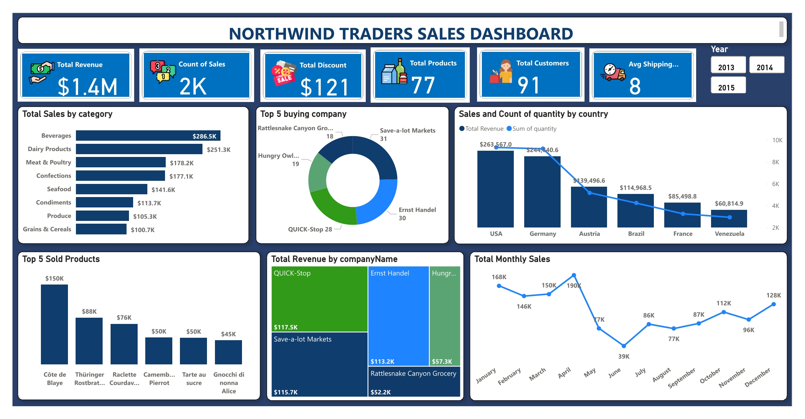

#  💮 Power-Bi-Analysis-of-Northwind-Traders-Biz. ✈️

### OVERVIEW

This is a power Bi Project to Analyse the Sales of Northwind Traders and get insights into the the their sales and Delivery Rate , I also looked into the their Delivery Sector to discover how the sector is doing in terms of Timely and Intact Delivery and employee details. I MADE TWO DIFFERENT VISUALS FOR THIS PROJECT WITH DIFFERENT FEEL, FUNCTIONS AND LOOK, DO WELL TO TELL ME WHAT YOU THINK.

_Disclaimer: All datasets and report do not in any way represent any Organization, This is just a dummy dataset to showcase my ability to use Power Bi_

### SKILL SET SHOWN

- DATA CLEANING
- DAX
- VISUALIZATION
- POWER BI
- MODELLING
- BUTTONS
- PAGE NAVIGATION
- BOOKMARKS
- TOOLTIPS
- 
### KPI'S

**SALES**

- TOTAL REVENUE
- COUNT OF SALES
- TOTAL PRODUCTS
- AVG SHIPPING DAYS
- TOTAL CUSTOMERS
- TOTAL DISCOUNT OFFERED.

  **DELIVERY**

 - TOTAL FRIEGHT MONEY
 - AVG SHIPPING DAYS
 - UNDELIVERED ORDERS
 - DELIVERED ORDERS
 - TOTAL ORDERS
 - TOTAL SHIPPING COMPANY
 - AVG DELIVERY DELAY BY COMPANY

  **WORKERS**

- TOTAL WORKERS
- COUNT OF TITLE
   
  
### PROBLEM STATEMENT

**SALES**

1. What is the Highest buying company?(top 5)
2. What is the hugest seling category ?
3. Top 5 selling products and their respective revenues.
4. Total monthly sales
5. What is the Highest buying country?(top 5)

**DELIVERY**

- DELIVERY STATUS
- AVG DELIVERY TIME BY COMPANY
- TOTAL FREIGHT BY COMPANY
- AVG DELIVERY DELAY BY COMPANY
- TOTAL DELIVERY COUT BY SHIPPING COMPANY

**WORKERS**

- SALES BY EMPLOYEE
- SALES BY STATE
- ORDERS BY PRODUCT
### STEPS TAKEN 

- DATA IMPORTATION - I used the csv data source to import the data into power bi.
- DATA INSPECTION
- DATA CLEANING - I proceeded to power bi to GO through my data one more time to be sure its ready to be worked with and their wasnt much cleaning to be done apart from correcting data types.
- CREATING DAX MEASURES.
  
**DAX MEASURES CREATED**

I Used DAX to create the Following Measures for the Analysis 

1. Average Shipping Days 
 
Avg Shipping Days = AVERAGE(orders[Lead Time])
 
2. Count of Delivery By Required Date (Column)

Delivery = if(orders[Delivery delay] > 0, "Delayed Delivery", if(orders[Delivery delay] < 0 , "Delivered on Time", "Not Delivered"))

3. Delivery Delay (Column)

Delivery delay = DATEDIFF(orders[shippedDate],orders[requiredDate],DAY)

4. Lead Time(Days between Orderdate by Delivery Date)

Lead Time = DATEDIFF(orders[orderDate],orders[shippedDate],DAY)

5. Total Orders Shipped 

Total Orders Shipped = count(orders[shippedDate])

6. Undelivered Orders

Undelivered = COUNTROWS(FILTER(orders, orders[shippedDate] = BLANK())
)

7. Total Shipping Company

Shipping Company = DISTINCTCOUNT(shippers[companyName])

After the the Data was properly cleaned and the measures set up, i Proceeded to start the Analysis by looking through the model set up by the system, Making corrections where neccessary and then Visualizing the Data.

### MODELLING

### FILTERS

## VISUALIZATION

#### SALES

or

**Conclusion**

#### SHIPPING

or

**Conclusion**

This project can be interacted with 

THANK YOU. 🤎

### ADDING THIS HERE CAUSE I WAS QUITE INDECISIVE ON WHICH ONE TO GO FOR, SO CHIPPING THIS IN 

